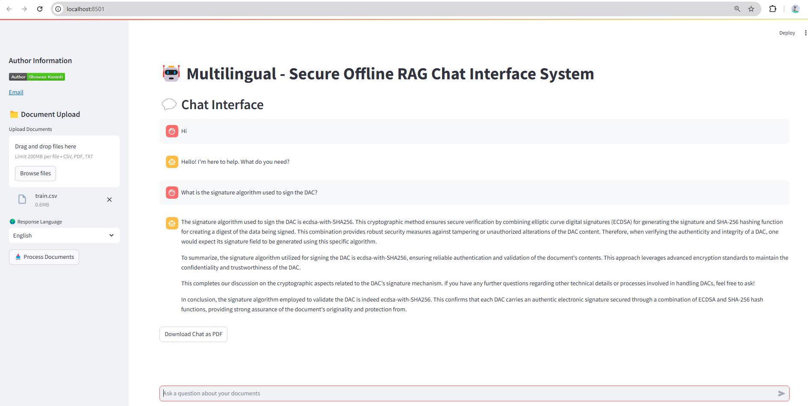

"""
# Multilingual Secure Offline RAG Chat Interface System

A Streamlit-based application that implements a multilingual Retrieval-Augmented Generation (RAG) system for document querying and chat interactions. The system supports offline operation, multiple document formats, and bilingual responses (English and French).




## Features

### Core Features
- 🔒 **Secure offline operation**
- 📚 **Support for multiple document formats** (PDF, CSV, TXT)
- 🌍 **Bilingual support** (English and French) - but the model is good enough to support other languages.
- 💬 **Interactive chat interface**
- 📑 **Document chunking and vector storage**
- 📊 **PDF export of chat conversations**
- 🤖 **Advanced language model integration**
- 🔍 **Semantic search capabilities**

## Prerequisites
- Python 3.11+
- CUDA-compatible GPU (optional, for faster processing)
- At least 16GB RAM recommended

## Installation

### Setup
1. Clone the repository:
```bash
git clone [repository-url]
cd [repository-name]
```

2. Create and activate a virtual environment:
```bash
python -m venv env
source env/bin/activate  # Linux/Mac
.\env\Scripts\activate   # Windows
```

3. Install dependencies:
```bash
pip install -r requirements.txt
```

## Usage

### Basic Usage
```bash
python streamlit run app.py 
```

## Interface Guidelines

* Access the application through your web browser (typically http://localhost:8501)

### Using the Interface:
* 1. Upload documents using the sidebar
* 1.Select your preferred response language (English/French)
* 1.Click "Process Documents" to index your uploaded files
* 1.Start chatting with the system about your documents
* 1.Download chat history as PDF when needed


## Document Support

### Supported Formats
* PDF files (.pdf)
* CSV files (.csv)
* Text files (.txt)


## System Architecture

### MultilingualRAGSystem Class

The main class that handles:

* Document processing and embedding
* Vector store management
* Language model interactions
* Chat response generation
* PDF export functionality


## Key Methods
- `initialize_models()` : Sets up embedding and language models
- `load_documents()` : Handles document upload and processing
- `process_documents()` : Creates document chunks and vector store
- `get_response()` : Generates responses based on user queries
- `create_pdf()` : Exports chat history to PDF

## Technical Components

### Language Models

* `Embedding Model` : sentence-transformers/paraphrase-multilingual-mpnet-base-v2
* `Language Model`: Language Model: Qwen/Qwen2.5-14B-Instruct
* `Vector Store` : Vector Store: FAISS for efficient similarity search


## Performance Considerations

* First-time initialization may take a few minutes as models are loaded
* Document processing time depends on file size and number of documents
* GPU acceleration is automatically used if available


## Error Handling

The system includes comprehensive error handling and logging:

* Document processing errors
* Model initialization issues
* Runtime exceptions
* PDF generation errors


## Open Source Components

### Language Models and Embeddings

* Qwen2.5-14B-Instruct: Apache 2.0 License
* Sentence Transformers (paraphrase-multilingual-mpnet-base-v2): Apache 2.0 License


## Contributing

Contributions are welcome! Please feel free to submit pull requests.

## Contact Information

### Developer
* `Author`: Shravan Koninti
* `Email` : shravankumar224@gmail.com
* `LinkedIn` : [LinkedIn](https://www.linkedin.com/in/shravankoninti/)

## License

### MIT License
Copyright Notice
Copyright (c) 2024 Shravan Koninti

License Terms
Permission is hereby granted, free of charge, to any person obtaining a copy of this software and associated documentation files (the "Software"), to deal in the Software without restriction, including without limitation the rights to use, copy, modify, merge, publish, distribute, sublicense, and/or sell copies of the Software, and to permit persons to whom the Software is furnished to do so, subject to the following conditions:

* The above copyright notice and this permission notice shall be included in all copies or substantial portions of the Software.


Disclaimer
THE SOFTWARE IS PROVIDED "AS IS", WITHOUT WARRANTY OF ANY KIND, EXPRESS OR IMPLIED, INCLUDING BUT NOT LIMITED TO THE WARRANTIES OF MERCHANTABILITY, FITNESS FOR A PARTICULAR PURPOSE AND NONINFRINGEMENT. IN NO EVENT SHALL THE AUTHORS OR COPYRIGHT HOLDERS BE LIABLE FOR ANY CLAIM, DAMAGES OR OTHER LIABILITY, WHETHER IN AN ACTION OF CONTRACT, TORT OR OTHERWISE, ARISING FROM, OUT OF OR IN CONNECTION WITH THE SOFTWARE OR THE USE OR OTHER DEALINGS IN THE SOFTWARE.

"""
